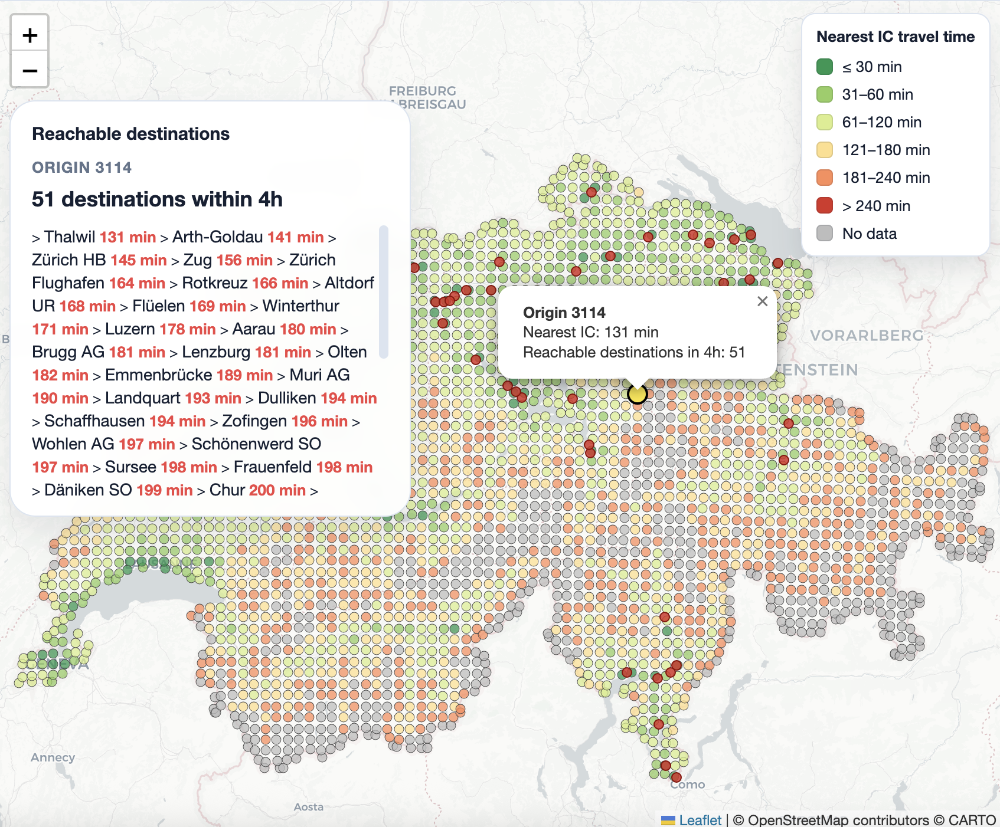
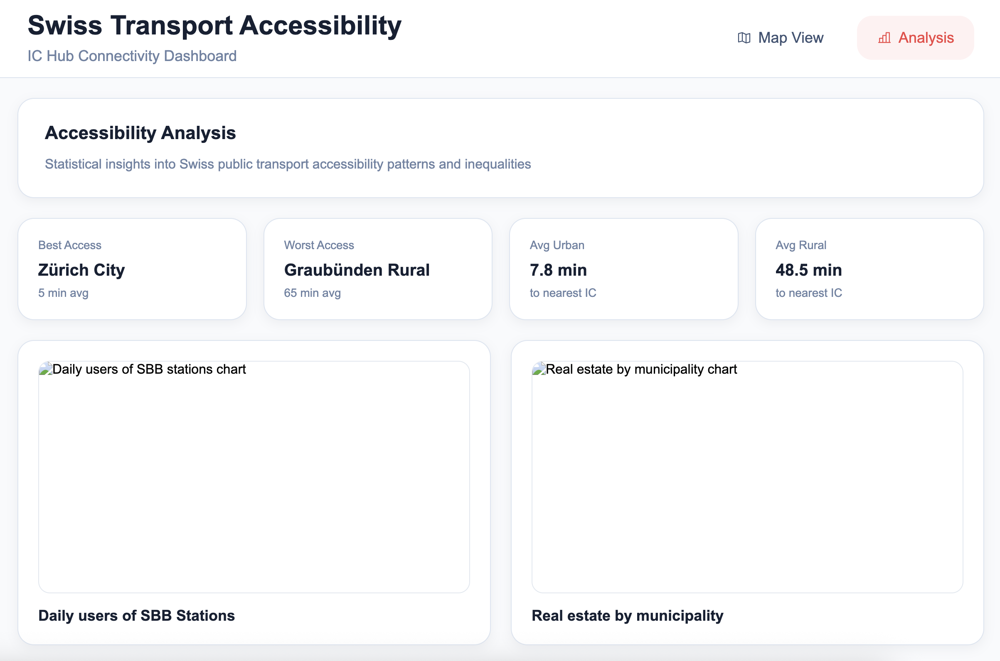

# Project of Data Visualization (COM-480)

| Student's name | SCIPER |
| -------------- | ------ |
| Ursula El-Khoury | 340994 |
| Sarah Badr | 341366 |
| Matthias Wyss | 329884 |

[Milestone 1](#milestone-1-20th-march-5pm) • [Milestone 2](#milestone-2-17th-april-5pm) • [Milestone 3](#milestone-3-29th-may-5pm)

## Milestone 1 (20th March, 5pm)

**10% of the final grade**

This is a preliminary milestone to let you set up goals for your final project and assess the feasibility of your ideas.
Please, fill the following sections about your project.

*(max. 2000 characters per section)*

### Dataset

This project relies on several open datasets describing the Swiss public transport network, geographic infrastructure, and socioeconomic indicators. These datasets are well documented, publicly available, and widely used in mobility research, making them appropriate for a visualization-focused project with limited preprocessing.

- [GTFS](https://data.opentransportdata.swiss/fr/dataset/timetable-2026-gtfs2020): Contains complete schedule of Swiss public transport and includes information about stops, routes, trips, and transfer times,
- [OpenStreetMap](https://planet.osm.ch/): Provides detailed information about roads, pedestrian paths, and urban infrastructure,
- [Population density grid](https://www.bfs.admin.ch/bfs/fr/home/statistiques/population/effectif-evolution.assetdetail.36249009.html),
- [Real estate indices statistics](https://www.bfs.admin.ch/bfs/fr/home/statistiques/prix/prix-immobilier.assetdetail.36412303.html), along with the [categorization of municipalities](https://www.bfs.admin.ch/bfs/fr/home/statistiques/prix/prix-immobilier.assetdetail.36409595.html),
- [Employment distribution](https://www.bfs.admin.ch/bfs/fr/home/services/geostat/geodonnees-statistique-federale/etablissements-emplois/statistique-structurel-entreprises-statent-depuis-2011.assetdetail.36073027.html), and [commune distribution](https://www.agvchapp.bfs.admin.ch/fr/boundaries?SnapshotDate=01.01.2026&Unit=Communes),
- [Passengers frequency](https://data.sbb.ch/explore/dataset/passagierfrequenz/export/?disjunctive.kt_ct_cantone&disjunctive.isb_gi&sort=jahr_annee_anno&dataChart=eyJxdWVyaWVzIjpbeyJjaGFydHMiOlt7InR5cGUiOiJsaW5lIiwiZnVuYyI6IkNPVU5UIiwiY29sb3IiOiIjOGRhMGNiIiwic2NpZW50aWZpY0Rpc3BsYXkiOnRydWV9XSwieEF4aXMiOiJjb2RlIiwibWF4cG9pbnRzIjoxMDAsInNvcnQiOiIiLCJjb25maWciOnsiZGF0YXNldCI6InBhc3NhZ2llcmZyZXF1ZW56Iiwib3B0aW9ucyI6eyJkaXNqdW5jdGl2ZS5rdF9jdF9jYW50b25lIjp0cnVlLCJkaXNqdW5jdGl2ZS5pc2JfZ2kiOnRydWUsInNvcnQiOiJqYWhyX2FubmVlX2Fubm8ifX19XSwidGltZXNjYWxlIjoiIiwiZGlzcGxheUxlZ2VuZCI6dHJ1ZSwiYWxpZ25Nb250aCI6dHJ1ZX0%3D&location=8,46.37157,8.39905&basemap=00c4d6)

### Problematic

Switzerland is often perceived as having one of the most efficient public transport systems in the world. However, accessibility to this network is not evenly distributed across the country. Geographic constraints, service frequency, infrastructure density, and urban concentration can significantly affect how easily people can reach major transport hubs or essential services. While many existing tools display transport routes or allow users to compute individual journeys, they rarely provide a nationwide view of accessibility and how it varies spatially.

This project aims to explore the following central question: how accessible is the Swiss public transport network across the country, and what factors explain the differences in accessibility between regions? In particular, the visualization focuses on how easily residents can reach major railway hubs (IC stations) using multimodal public transport, considering door-to-door travel time including walking, local transport (bus, tram, metro), transfers, and waiting times.

By combining open mobility datasets (GTFS timetables) with geographic and socioeconomic data such as population density, housing prices, employment distribution, and public transport usage, the project seeks to highlight patterns between transport accessibility and regional characteristics. The visualization will compute accessibility metrics such as travel time to the nearest IC station, connectivity scores of stations, transfer complexity, and the number of destinations reachable within a given time threshold.

The resulting interactive map will display accessibility through tools such as isochrone maps, accessibility heatmaps, and comparative visualizations, allowing users to explore disparities between urban and rural areas, mountainous regions and the Swiss plateau, or regions with varying levels of infrastructure density.

The main objective is to provide an intuitive and data-driven overview of how mobility infrastructure shapes daily accessibility in Switzerland. The visualization targets a broad audience including students, researchers, urban planners, and the general public interested in understanding how transport networks influence regional connectivity, commuting possibilities, and territorial inequalities.

### Exploratory Data Analysis

The exploratory data analysis and preprocessing of the datasets are conducted in a dedicated Jupyter notebook named `analysis.ipynb`. This notebook contains all steps required to prepare the data for the visualization, including data loading, cleaning, and transformation.
The GTFS data are explored to understand stops, routes, trips, and the structure of the Swiss public transport network. The notebook also analyses population density by canton, real-estate values by municipality, employment distribution by canton and commune, and passenger frequency per station, providing the groundwork for the final visualization.

### Related work

- What others have already done with the data?

A first source of inspiration is [isochrone.ch](https://www.isochrone.ch/?origin=Parent8504100), which visualizes travel-time isochrones from a given location. These maps show areas reachable within a certain time using public transport. While this approach highlights how accessibility varies spatially from a single point, it does not provide a global overview of accessibility across the entire country or allow comparisons between regions.

Another reference is the project [Switzograms](https://rubenfiszel.github.io/switzograms/visualization/dist/map.html#), which presents interactive visualizations of Swiss geographic and statistical datasets. The map interface demonstrates how spatial data can reveal interesting national patterns through interactive exploration. However, this project focuses on statistical distributions rather than mobility accessibility or transport network analysis.

- Why is your approach original?

More generally, common mobility tools such as journey planners from Swiss Federal Railways allow users to compute travel routes between two locations using multimodal transport. These platforms provide detailed routing information but operate at the individual trip level and do not offer aggregate visualizations of accessibility or regional inequalities.

The originality of this project lies in combining transport network analysis with socioeconomic and geographic indicators to create a nationwide accessibility visualization. Instead of computing routes for specific trips, the project evaluates accessibility metrics such as door-to-door travel time to major railway hubs, connectivity scores, transfer complexity, and the number of reachable destinations within a given time threshold. By integrating additional datasets such as population density, housing prices, and employment distribution, the visualization aims to explore how transport accessibility interacts with urban development and regional disparities.

- What source of inspiration do you take? Visualizations that you found on other websites or magazines (might be unrelated to your data).

In terms of visual inspiration, the project draws from isochrone-based mapping techniques, geographic heatmaps, and interactive spatial visualizations commonly used in urban mobility studies. These approaches allow users to intuitively explore spatial patterns and inequalities in infrastructure accessibility. The goal is therefore to combine these visualization techniques with Swiss open transport data to produce an interactive map that highlights how accessibility varies across Switzerland’s diverse geography.

- In case you are using a dataset that you have already explored in another context (ML or ADA course, semester project...), you are required to share the report of that work to outline the differences with the submission for this class.

Nothing to report.

## Milestone 2 (17th April, 5pm)

**10% of the final grade**

**Live Prototype:** [https://com-480-data-visualization.github.io/les-vizionnaires/](https://com-480-data-visualization.github.io/les-vizionnaires/)

---

### 1. Project Goal
The primary objective of this project is to visualize and analyze the spatial accessibility of the Swiss public transport network, specifically focusing on the time required to reach major InterCity (IC) railway hubs. While Switzerland is renowned for its dense transport network, significant regional disparities exist. 

By layering transport accessibility with socioeconomic indicators (real estate prices, employment density, average salary and passenger frequency), we aim to provide an interactive tool that reveals how connectivity correlates with urban development and territorial inequalities. Users should be able to identify "undervalued" regions (good accessibility but lower prices) or "isolated" hubs through an intuitive map-based interface and statistical analysis.

### 2. Visual Design & Sketches

#### Map View (The Spatial Dimension)
The main interface features a full-screen interactive map of Switzerland. We have opted for a **grid-based encoding** where each point represents a 4km² area. 

- **Visual Encoding:** For the "Nearest IC travel time" mode, we use a divergent color scale (Green → Yellow → Red). Points that cannot reach a hub within the `MAX_TIME` threshold are rendered in Grey.
- **Layers:** Users can toggle between four thematic maps:
    1. **Travel Time to IC:** Proximity to major hubs.
    2. **Real Estate:** Average price per m².
    3. **Employment:** Concentration of jobs.
    4. **Salary:** Average salary per m².
    5. **Adoption Rate:** SBB station daily usage.
- **Interactions:** A sidebar includes sliders to adjust precomputed time-steps (e.g., 08:00, 12:00, 17:00, 22:00) and the maximum travel time threshold (30min to 4h). Clicking a point triggers a **Detail-on-Demand** popup.

#### Analysis View (The Statistical Dimension)
This view moves away from geography to focus on abstract data relationships using **D3.js** charts.

- **Correlation Scatter Plot:** X-axis (Travel Time) vs Y-axis (Real Estate Price) to identify outliers.
- **Bar Charts:** Comparison of accessibility metrics across different Cantons.
- **Distribution Histograms:** Percentage of the population living within specific time brackets of major infrastructure.

### 3. Tools and Lectures

#### Technical Stack
- **Data Processing:** `Python` with `r5py` to compute multimodal matrices using GTFS and OSM data.
- **Frontend:** `JavaScript`, `HTML5/CSS3`.
- **Map Engine:** `Leaflet.js` for handling the tiled map and point-grid overlays.
- **Visualization:** `D3.js` for the Analysis view charts and interactive widgets.

### Relevant Lectures
- **Lecture 4 (Data & Data-driven documents):** We apply the Data-Join pattern (enter/update/exit) to link socioeconomic attributes to our grid. We use Scales to map quantitative data (travel time, prices) from the data domain to visual ranges (colors and positions).
- **Lecture 5 (Interaction & Interactive D3):** Following Shneiderman’s mantra, we provide a "Map Overview" before allowing users to filter by time or zoom for "Details-on-demand." The "Analysis View" implements Coordinated Views to show the same data through different lenses (spatial vs. abstract).
- **Lecture 6 (Perception, color & Marks and channels):** Our grid uses Points as marks. We prioritize Position (the most accurate channel for quantitative data) for the coordinates, and Color Hue/Saturation to encode accessibility and prices, respecting Gestalt principles for grouping regional patterns.
- **Lecture 7 (Design for data viz & Do’s and don’ts):** We follow the 4-level model to ensure our visual idioms match the data abstraction. We maintain Graphic Integrity by ensuring our color scales are perceptually uniform and our axes (in the Analysis View) start at zero to avoid the "Lie Factor."
- **Lecture 8 (Maps):** We address the challenges of Geographic Projections by using Leaflet.js. Our visualization combines a Grid-based map (for travel times) and thematic overlays, using GeoJSON logic for spatial data handling.
- **Lecture 11 (Tabular Data):** For the Analysis View, we will use Scatter Plots and Bar Charts to explore multidimensional relationships between accessibility, real estate, and employment, moving beyond simple spatial representation.

### 4. Project Breakdown

#### Core Visualization (MVP)
- [x] **Data Pipeline:** Extraction of IC Hubs from GTFS and 4km² grid generation.
- [x] **Precomputation:** Initial travel time matrix for a Friday at 08:00 AM using `r5py`.
- [x] **Functional Map:** Interactive Leaflet map with point-grid rendering and zoom capabilities.
- [x] **Basic UI:** Sidebar and tab navigation.
- [x] **Details-on-Demand:** Tooltips/Popups showing hub connectivity and travel time.

#### Extra Features (Milestone 3)
- **Multi-temporal Data:** Precomputing slots for 12:00, 17:00, and 22:00.
- **Socioeconomic Layers:** Integration of Real Estate, Employment, Salary and Adoption datasets as switchable map layers.
- **Advanced Analysis View:** Full D3.js suite with linked highlighting between charts and the map.
- **Visual Refinement:** Polishing the UI and potentially transitioning to hexagonal binning for better aesthetic density.

### 5. Prototype Review
The current prototype is fully operational and hosted on GitHub Pages. It features a robust navigation system between the **Map View** and **Analysis View**. 

The core engine for the "Nearest IC travel time" is already implemented: the user can explore the Swiss territory, zoom in for regional details, and interact with the data points to get precise travel metrics. The precomputation logic in Python ensures a smooth user experience despite the complexity of the underlying multimodal routing. The current focus for the final milestone is the data integration for the three additional thematic maps and the development of the D3.js correlation charts to bridge the gap between mobility and socioeconomic factors.

**Live URL:** [https://com-480-data-visualization.github.io/les-vizionnaires/](https://com-480-data-visualization.github.io/les-vizionnaires/)

## Milestone 3 (29th May, 5pm)

**80% of the final grade**

## Late policy

- < 24h: 80% of the grade for the milestone
- < 48h: 70% of the grade for the milestone

